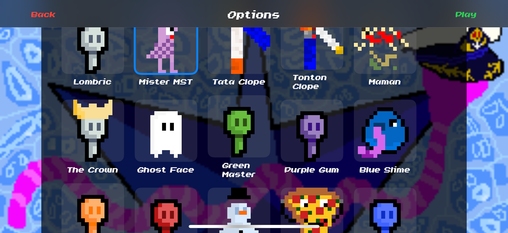
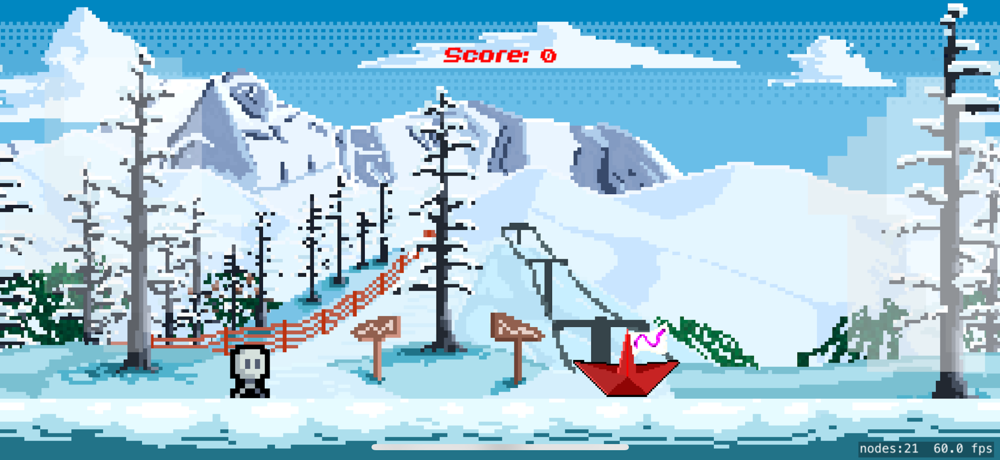
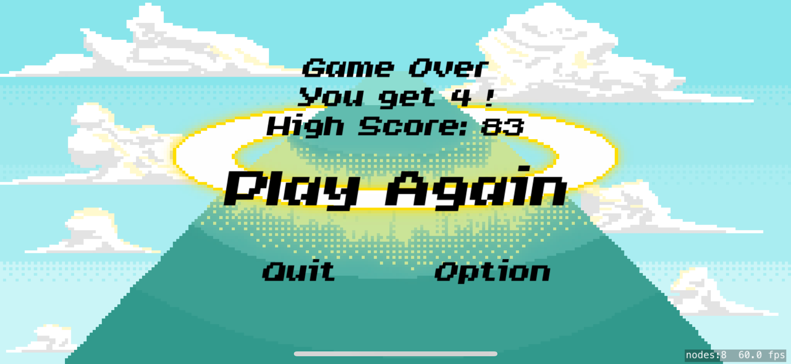
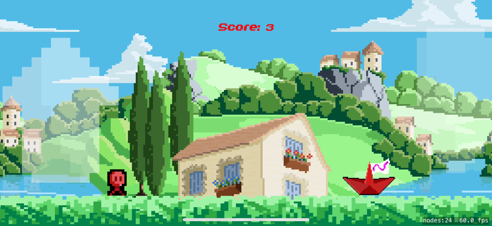

# Lombric Runner

  
  
  
  
  

Get ready for a thrilling adventure with **Lombric Runner**, the runner-style game that will keep you on the edge of your seat! Run, jump, and dodge your way through stunning environments.

## Features

- **Stunning Graphics**: Immerse yourself in beautifully designed worlds with incredible detail. Only **16x16 pixel art** for a retro charm.
- **Addictive Gameplay**: Simple, intuitive controls for a smooth and engaging experience.
- **Exciting Challenges**: Take on levels of increasing difficulty and unlock new content.
- **Customization**: Personalize your character with unique outfits and accessories.
- **Dynamic Backgrounds**: Choose from various animated backgrounds like **Les Arcs**, **Dordogne**, **Lascaux**, and **Snow**, each with unique visual effects and music【15†source】【16†source】.
- **Obstacle Variety**: Dodge a range of obstacles with varying behaviors to keep the gameplay engaging【15†source】.
- **Interactive Weather Effects**: Experience snowfall with dynamic snowflake animations in the **Snow** background【15†source】.

## Download Now!

Download **Lombric Runner** now and start your adventure! Are you up for the challenge?

## 🎨 Contribute Your Own Sprites!

We'd love to see your creativity! You can send your own sprites to help create new free skins. Please follow these guidelines:

- **Format**: `.png` file
- **For the main character**:
  - **Running animation**: 8 frames, 16x16 pixels each
  - **Jumping animation**: 1 frame, 16x16 pixels

Send your creations to: **decima.ewan@gmail.com**

---

Ready to run? Start your adventure now with **Lombric Runner**!

